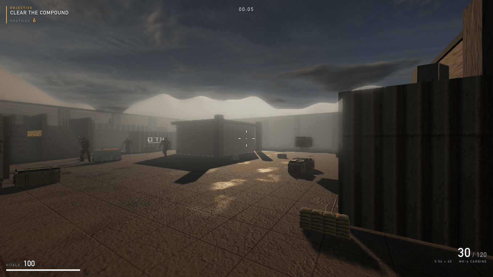
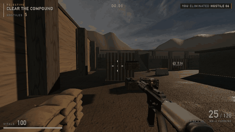

# Operation Nightfall

A hand-built browser FPS. WebGL, TypeScript, three.js, no engine — and, as of
M4, co-op for two to four players against the same AI.





*Both images come out of the test suite: the still is one of seven captured on
every run, and the clip is a six-second recording of the same competent-player
bot the difficulty was measured with — so what the README shows and what the
build actually does cannot drift apart.*

---

## Quickstart

```bash
npm install
npm run dev          # Vite on :5178 AND the co-op server on :8787
```

Open **http://localhost:5178/** and press **DEPLOY**. Click the canvas to hand
the mouse over; **Esc** takes it back.

### Co-op

One player presses **HOST** and reads out the four-character room code. Everyone
else types it into **ROOM CODE**, presses **JOIN**, then **DEPLOY**. Up to four
soldiers per room.

```bash
npm run dev:solo     # Vite only — the single-player game, complete
npm run server       # the co-op server only, on :8787
npm run build        # typecheck + production build
npm run smoke        # the whole verification suite (85 assertions)
node tools/mp_driver.mjs   # just the co-op path: two real clients, ~13 s
```

**The single-player game works with the server switched off.** `src/net/` is
removable — `Game.net` is `null` offline, nothing in boot touches a socket, and
every use is guarded. Full controls, settings and the co-op flow are in
[HOW_TO_PLAY.md](HOW_TO_PLAY.md).

---

## What is in it

**The world.** A two-storey walled compound generated from one spec list that
drives the geometry *and* the collision boxes — 106 collider specs, 328 nav
waypoints, 30+ props each fitted to its own collider. The enclosure is audited
by raycast rather than trusted.

**The AI.** Six soldiers with a real state machine — patrol, advance, halt, aim,
fire, reposition — that navigate the graph, use the stairs, flank, and obey one
doctrine rule absolutely: **they never fire while moving.** That is enforced as
an in-engine invariant and audited continuously by the suite.

**The weapon.** A generated carbine, fitted geometrically rather than by eye: the
optic is moved onto the ADS axis in model space, so aiming down the sight puts
the reticle on the crosshair to within a hundredth of a pixel. The magazine is
split out of the single generated mesh so the reload can actually drop it.

**The look.** A photographic HDRI dusk sky with its sun angle *measured off the
pixels* and matched by the key light, PBR materials baked seamless, selective
bloom on an explicit allow-list, ACES tone mapping that is identical in both
render paths, SMAA.

**The feel.** Hitstop, screenshake with trauma falloff, FOV kick, viewmodel
sway/punch, ejected shells, a hit marker and a kill feed. Audio is synthesised at
runtime — no audio files ship, and the same synth plays six soldiers at six
ranges as six filter settings.

**Co-op.** An authoritative Node/TypeScript WebSocket server that runs **the
game's own `Enemy`, `NavGraph`, `CollisionWorld` and `arenaLayout()`** rather
than a server-side reimplementation of them. Enemies are server-authoritative,
hits are server-validated (a client sends an origin and a direction, nothing
else), your own movement is client-authoritative by choice. Remotes are rendered
120 ms in the past, interpolated between two snapshots that have already
arrived, and never extrapolated.

---

## Measurements

Everything below is a number the harness printed, not an impression. The suite
(`npm run smoke`) serves the production build, drives it over CDP, and reads the
live simulation.

| | measured |
| --- | --- |
| **Verification suite** | **85 / 85 assertions green** |
| Frame cost, post-processing ON | **16.67 ms — a locked 60 fps** (Apple M4 / ANGLE-Metal, 1600×900, vsync on, 120-frame window) |
| Frame cost, post-processing OFF | 16.67 ms |
| Ambient occlusion (GTAO), if enabled | 18.9–22.8 ms mean, 33.4 ms p95 = 44–53 fps → **ships OFF**, offered in settings |
| ADS optic alignment | **0.00 px from screen centre** (NDC 0.00000, −0.00000) |
| Viewmodel screen coverage | 5.77% hip / 8.14% ADS — budget 15% |
| Frame luminance | 0.172 postfx-ON, 0.198 postfx-OFF, **Δ0.026** · 0.0% clipped white, 1.5% crushed black |
| Arena enclosure | **1600 rays cast, 0 leaks** |
| AI doctrine (never fire while moving) | **0 violations**, worst speed 0.0000 m/s, all six states observed |
| Generated carbine | 13,734 verts, 0.86 m overall, optic local (0.000000, 0.093000), 777 magazine triangles split out |
| Nav graph | 328 waypoints across two storeys, from 106 collider specs |
| Win rate (competent-player bot) | **59.4%** — 38 wins in 64 runs, 95% CI ≈ [47%, 71%] |
| Co-op snapshot rate | 15 Hz, rendered at −120 ms |
| Remote interpolation smoothness | worst frame **2.23–2.53×** the mean, **12.5–15.6%** frozen (a snapshot-stepping client reads ~4× and ~75%) |
| Shipped payload | assets 13.8 MB (models 6.1 · textures 5.3 · sky 2.4) · bundle 861 kB / **252 kB gzip** |
| Console errors or warnings | 0 |

The difficulty number is worth one extra line, because the interesting result
was about the *measurement*: at n=32 the 95% interval on a proportion near 0.5
is ~35 points wide against a target band 10 points wide, so a run of tuning
passes was resolving nothing. `tools/balance.mjs` now prints the confidence
interval and refuses to call a band it cannot resolve.

---

## The write-ups

This project keeps two long documents, and they are the point as much as the
game is.

- **[BUILD_STATE.md](BUILD_STATE.md)** — the running ledger. What was built,
  in what order, what it measured, and every bug found along the way with the
  number that found it.
- **[DECISIONS.md](DECISIONS.md)** — the arguments. Why the authority split is
  asymmetric, why ambient occlusion ships off, why the tone-mapping code is
  deliberately duplicated, why one clip in the animation map is a compromise.

---

## Credits

**3D models** — the soldier, the carbine and the prop set were generated with
[**Tripo**](https://www.tripo3d.ai/) (text-to-model on the v2 chain, then
low-poly conversion), then auto-rigged and hand-fitted here. The generation
receipts — task ids, credit cost, byte sizes — are written per asset by
`assetgen/tripo_gen.py`.

**Animation** — the six locomotion and combat clips are **CC0** from the
[**Mesh2Motion**](https://mesh2motion.org/) animation library, copied natively
onto that project's canonical 66-joint human skeleton. Public domain, no
attribution required; credited because it is owed.

**Sky** — `industrial_sunset_02_puresky` from
[**Poly Haven**](https://polyhaven.com/a/industrial_sunset_02_puresky), CC0.

**Textures** — baked procedurally by `assetgen/bake_textures.py`. Nothing
sampled, nothing sourced.

**Audio** — synthesised at runtime in `src/audio/`. No files.

**Engine** — [three.js](https://threejs.org/) r185, and nothing else at runtime.

---

## Licence

[MIT](LICENSE). The third-party assets above carry their own terms, all of them
CC0 or generated for this project.
